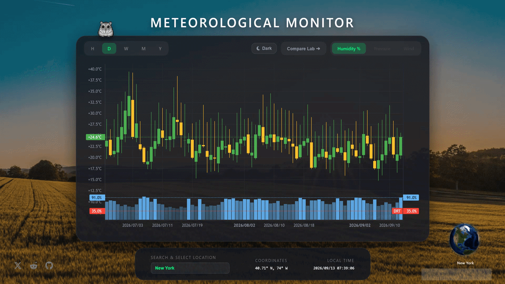

<div align="center">

  # Global Weather K-Line Monitoring System

  <p align="center">
    <b>English</b> | <a href="README_CN.md">简体中文</a>
  </p>

  <br>

  <p align="center">
    🌍📈 Visualize global climate fluctuations and meteorological data through professional financial K-line charts.
  </p>

  <!-- Status & Tech Stack Badges -->
  <p align="center">
    <a href="https://github.com/xuelefei4-blip/Global-Weather-KLine/actions"></a>
    
    
    
    
  </p>

  <p align="center">
    <a href="https://github.com/xuelefei4-blip/Global-Weather-KLine/issues"></a>
    <a href="https://github.com/xuelefei4-blip/Global-Weather-KLine/discussions"></a>
  </p>

</div>

---

## 📸 Live Preview

<p align="center">
  
</p>

## ✨ Features

* 📦 **Zero Backend Dependency**: Pure static frontend architecture. Run it locally or access it directly via web browsers.
* 🚀 **TradingView Engine**: Built on `Lightweight Charts` for smooth, high-performance dragging and zooming of massive meteorological datasets.
* 🌐 **3D Globe Selector**: Features an interactive `Globe.gl` 3D earth. Switch observation spots effortlessly by rotating and clicking the globe (currently covering 170 global core cities).
* 📊 **Multi-dimensional K-Line**: A unified dashboard aggregating historical fluctuations of **temperature, humidity, and atmospheric pressure**.
* 🔬 **Dual-City Lab**: Supports side-by-side multi-dimensional comparison for two cities, ideal for cross-regional climate correlation analysis.
* ⏳ **Multi-Resolution**: Smooth switching between Hour (H), Day (D), Week (W), Month (M), and Year (Y) timeframes.
* 🌗 **Dual Theme**: Native adaptation for both Dark and Light modes to match any viewing environment.

---

## 📦 Project Structure (Architecture)

```text
Global-Weather-KLine/
└── MeteoSystem/               # Meteorological K-Line Monitoring & Multi-dimensional Lab System
    ├── .vscode/               # VS Code development configs (e.g., Live Server port)
    ├── docs/                  # Documentation & preview assets (includes preview GIF)
    ├── static/                # Static asset library
    │   ├── css/               # Stylesheets
    │   ├── data/              # Meteorological JSON database for 170 global cities
    │   └── images/            # Globe textures & icon resources
    ├── kline.html             # Single-city meteorological K-line monitoring main interface
    └── lab.html               # Dual-city side-by-side comparison laboratory